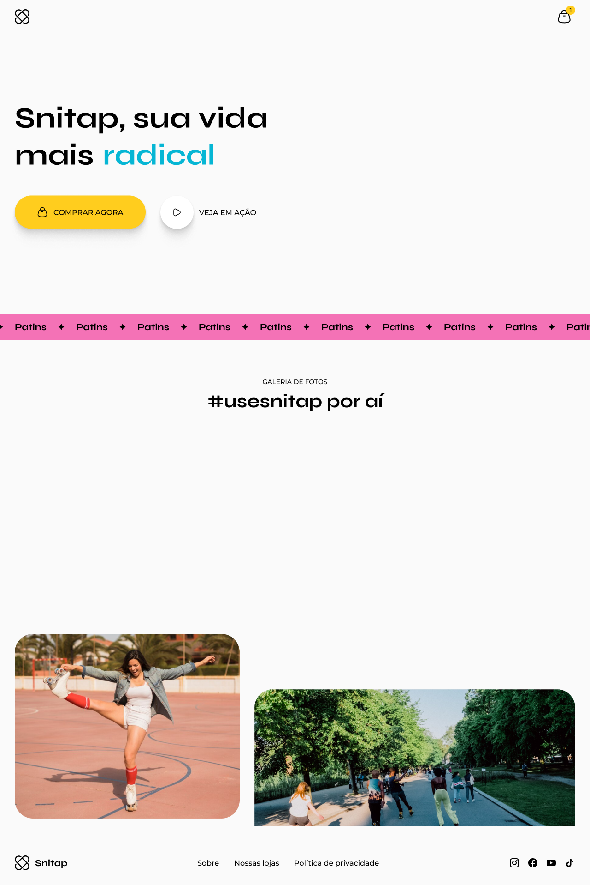
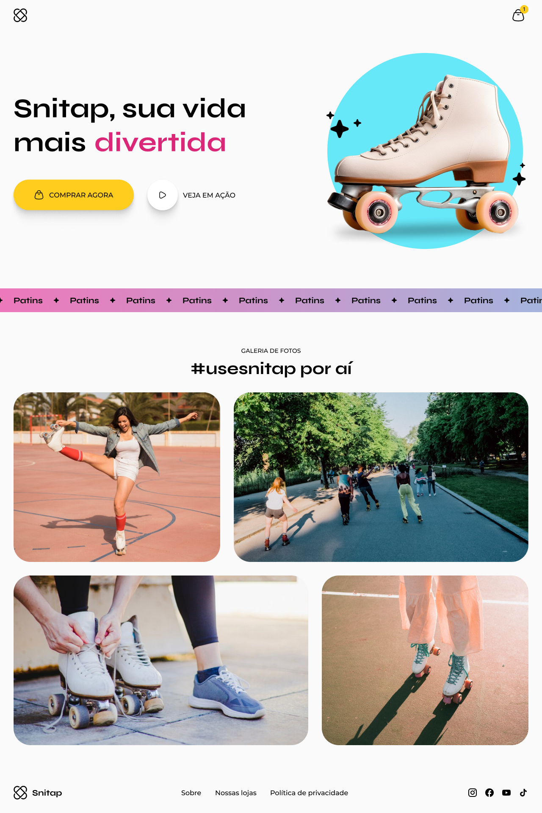

<strong><h1 align="center">🛼 Landing Page Animada de Patins</h1></strong>

Este projeto apresenta o design de uma landing page animada para promoção de patins, desenvolvida no Figma. O layout combina elementos modernos com toques animados, criando uma interface visualmente atrativa, especialmente voltada para o público jovem e esportivo.

📌 Sobre o Projeto

O objetivo deste design é criar uma página promocional envolvente e responsiva que destaque os diferenciais dos patins de forma clara, dinâmica e convidativa. A estética jovem e o uso de animações tornam o layout ideal para campanhas publicitárias e e-commerces do segmento esportivo.

🧩 Principais Seções
- Hero Section com chamada de ação e imagem principal
- Diferenciais do Produto apresentados com ícones e descrições
- Sessão de Destaques Visuais com foco em cores vibrantes e tipografia moderna
- Rodapé com informações de contato e redes sociais

## 🎨 Layout

O layout do projeto está disponível no [Figma](https://www.figma.com/design/NtRdvpWIfbmZtVmU0yFwqE/LP-de-patins-animada--Community-?node-id=915-685&t=ruuDo5FY9SeyD0MU-0)

    
    

## 🚀 Tecnologias

Esse projeto foi desenvolvido com as seguintes tecnologias:

- HTML e CSS
- Git e Github
- Figma

## 🚀 Pré-requisitos

Antes de começar, você vai precisar ter instalado em sua máquina as seguinte ferramenta:

Feito com ♥ by [Gelzieny](https://gelzieny-portfolio.vercel.app/)

